# QC Scanner

[](LICENSE.txt)

**Take a photo of a document and get back a flat, cropped scan.**

QC Scanner finds the sheet of paper in a photo — shot at an angle, on a cluttered desk — detects its
four corners, and applies a perspective transform so the page comes out flat and trimmed. It is a
**pre-processing step** for OCR / document-understanding pipelines: flatter page, sharper glyphs,
better extraction downstream.

<p style="display: flex;align-items: center;justify-content: center;">
  
  
  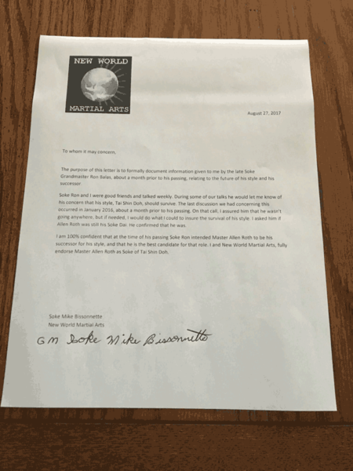
  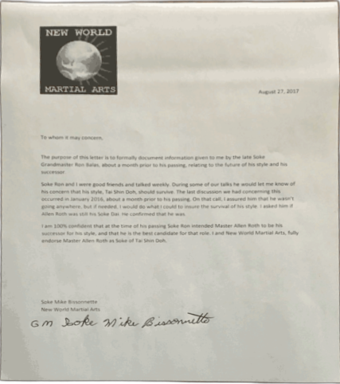
  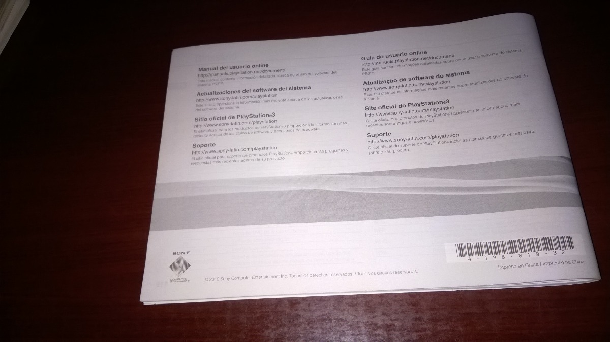
  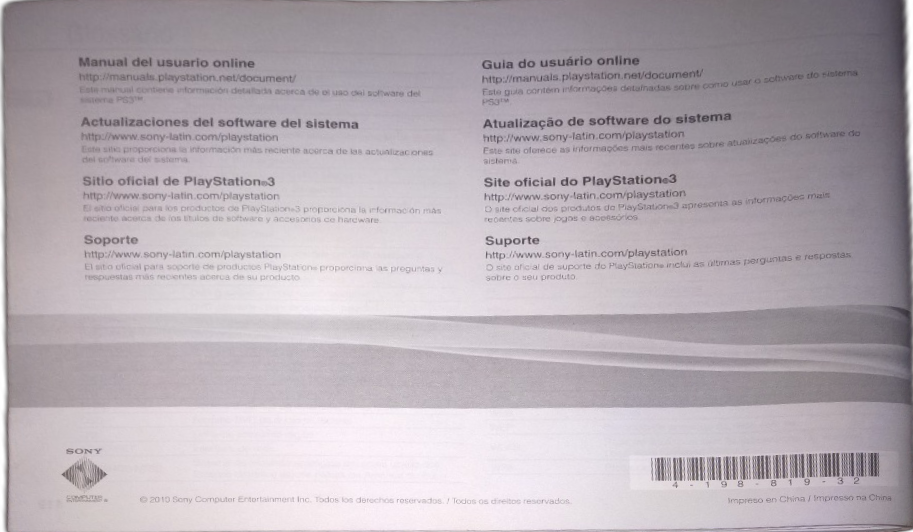
  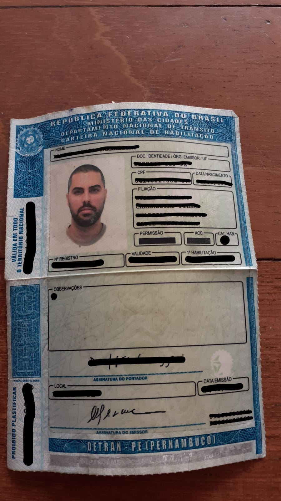
  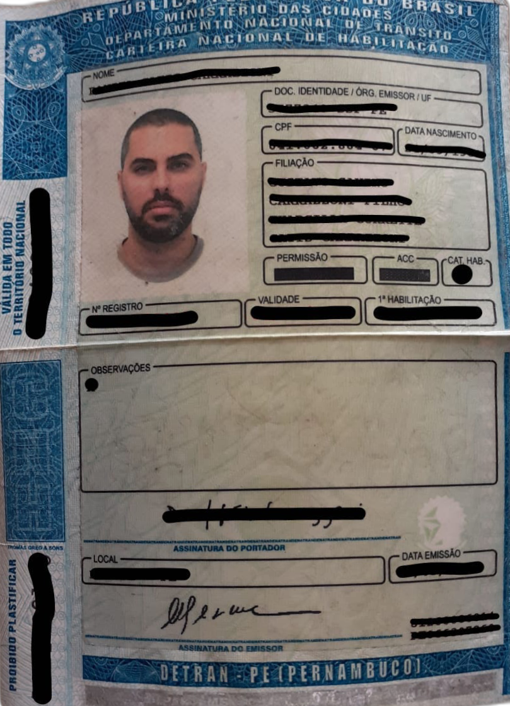
  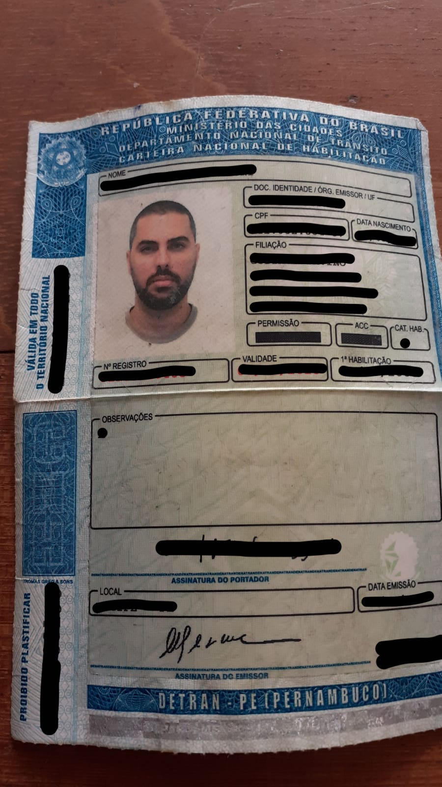
  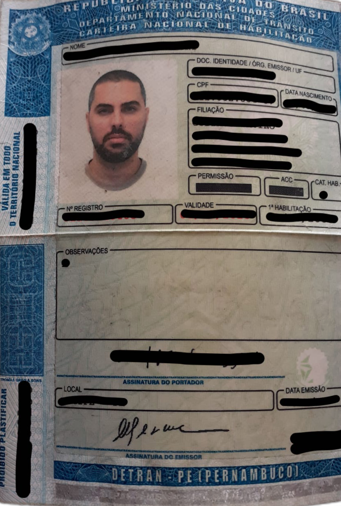
  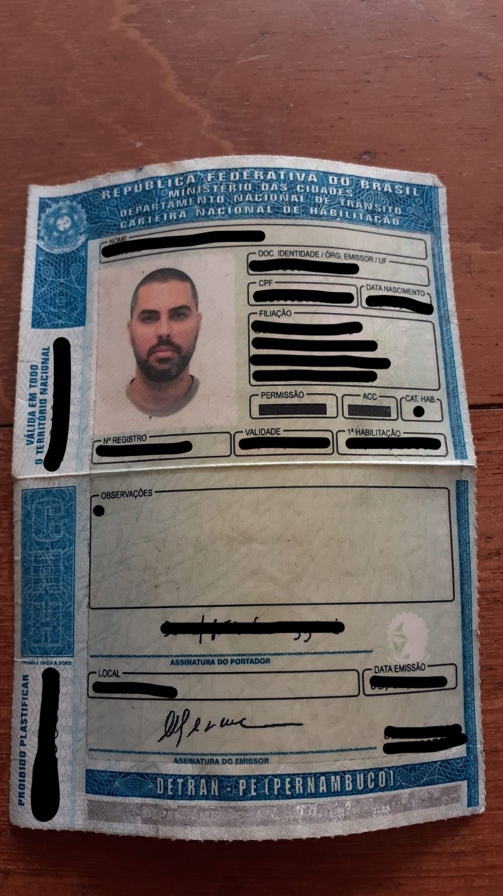
  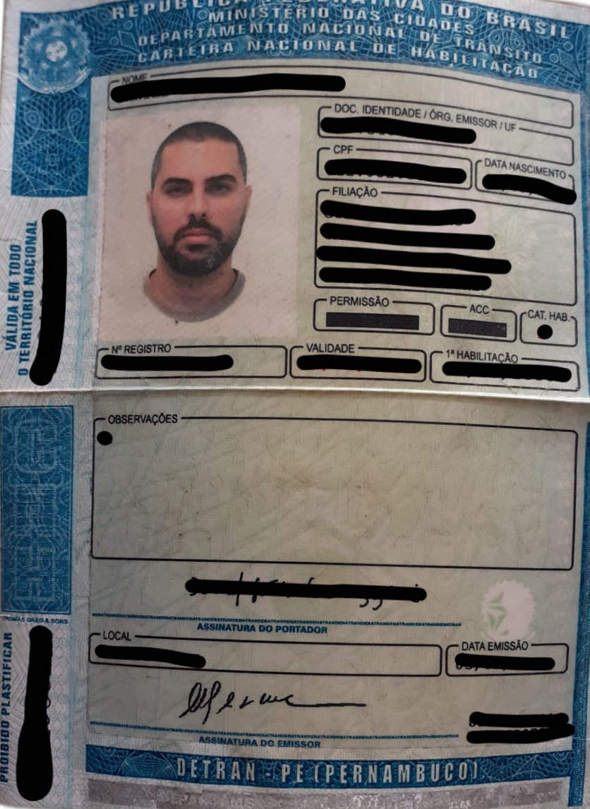
  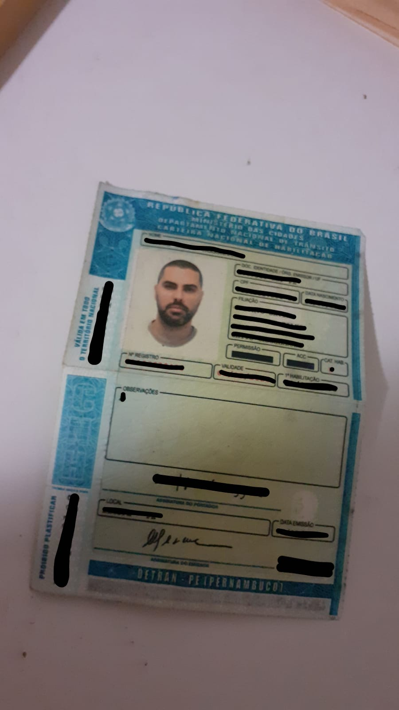
  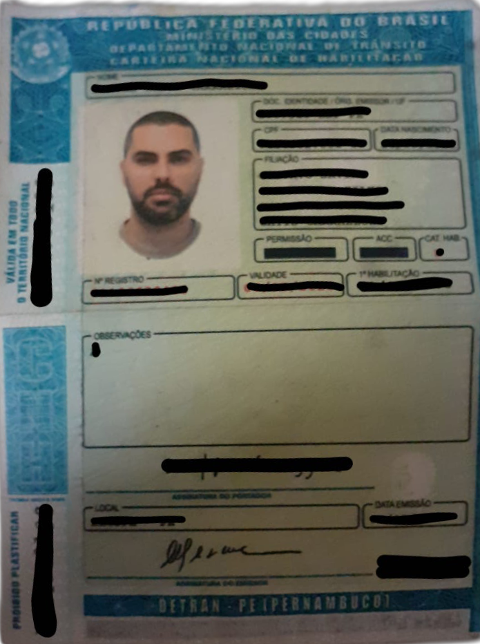
  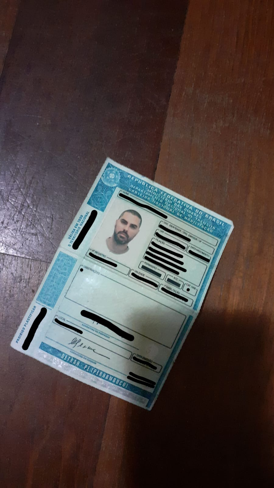
  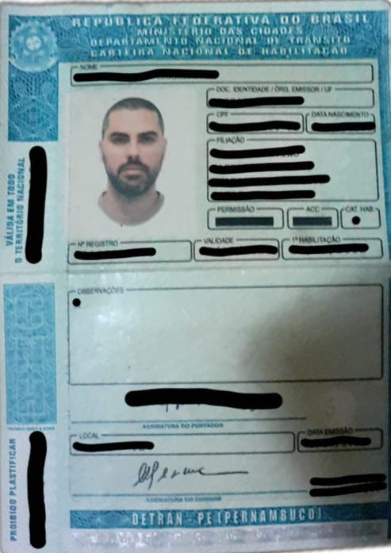
</p>

### How it works

```
photo ──► rembg (U²-Net)  ──►  alpha mask  ──►  lọc + chọn tứ giác  ──►  4 corners
              │                    │                                        │
              │  rembg thua        │  metric hình học + chất lượng          │
              ▼                    ▼                                        ▼
        edge-Hough fallback   reasons[] + verdict          four-point transform → PNG
```

Một hàm lõi `scan_qc()`, ba mặt tiền (CLI, HTTP server, Python library) — tất cả gọi cùng nó.
Không database, không hàng đợi. Chi tiết: [docs/algorithm.md](docs/algorithm.md).

Đầu ra **luôn là PNG** — cố ý. Ảnh này đi tiếp vào OCR/VLM, và nhiễu nén JPEG quanh nét chữ
nhỏ làm giảm độ chính xác bóc dữ liệu.

### Mỗi lần xử lý trả về một phán quyết

```python
from qc_scanner import scan_qc

result = scan_qc(open("photo.jpg", "rb").read())
result.verdict          # "pass" | "warn" | "fail"
result.codes            # ["CLIPPED_EDGE"]
result.reasons[0].hint  # "Một phần tài liệu nằm ngoài khung hình. Lùi máy ra..."
result.metrics.skew_ratio
result.image            # PNG bytes
```

Bất biến: `verdict == "pass"` ⟺ `reasons == []`. Mã lý do nào cũng kèm `hint` (làm gì tiếp
theo) và `audience` (ai phải làm: người chụp / vận hành / hệ thống gọi).

### Installation

Chưa publish lên PyPI — cài từ nguồn:

```bash
pip install -r requirements.txt
pip install .
```

> ⚠️ **Lần chạy đầu tải model rembg** (~176MB, về `~/.u2net/`). Máy không có mạng sẽ fail ở
> đây, không phải trong code. Dùng [Dockerfile](Dockerfile) / [docker-compose.yml](docker-compose.yml)
> để có sẵn model trong image.

### Usage as a CLI

```bash
qc-scanner photo.jpg out.png          # exit 0 pass · 1 warn · 2 fail · 3 đầu vào hỏng
cat photo.jpg | qc-scanner > out.png  # pipe vẫn chạy như cũ
qc-scanner photo.jpg out.png --report qc.json
```

Báo cáo QC ra stderr (hoặc `--report`):

```json
{
  "verdict": "warn",
  "reasons": [{"code": "CLIPPED_EDGE", "severity": "warn",
               "hint": "Một phần tài liệu nằm ngoài khung hình. Lùi máy ra để thấy trọn 4 mép.",
               "audience": "capturer"}],
  "metrics": {"quad_area_ratio": 0.79, "skew_ratio": 1.0, "touches_border": 3, "...": "..."}
}
```

### Usage in batch (thứ vận hành cần nhất)

```bash
qc-scanner-batch anh-vao/ anh-ra/ --report qc.csv
qc-scanner-batch anh-vao/ anh-ra/ --report qc.csv -j 4    # nhiều luồng hơn
```

CSV có một dòng mỗi ảnh: file, verdict, reasons, và toàn bộ metric — đủ để lọc ra đúng những
ảnh cần soi lại. `--jobs` mặc định 2 (đo trên CPU thì quá 2 không nhanh thêm — onnxruntime vốn
đã dùng hết nhân); thứ tự dòng trong CSV không phụ thuộc số luồng.

### Chạy bằng Docker (cách bàn giao chính)

```bash
# trên máy A (máy dựng service)
docker compose up --build -d
docker compose logs -f qc-scanner

# macOS: cổng 5000 bị AirPlay Receiver chiếm → dùng cổng khác
QC_SCANNER_PORT=8000 docker compose up --build -d

# từ máy B trong cùng LAN
curl -F "file=@photo.jpg" "http://<IP-máy-A>:5000/?format=json"
```

Model rembg được **nướng sẵn vào image** lúc build, nên container chạy được cả khi máy đích
không ra Internet. Hợp đồng API đầy đủ: **[docs/api.md](docs/api.md)**.

`docker-compose.yml` mở cổng `5000` trên **mọi giao diện mạng** của máy A, đúng cho mô hình
service ở máy A – ứng dụng ở máy B.

> ⚠️ Kèm theo đó: **bất cứ ai trong LAN cũng gọi được**, và thứ gửi lên là ảnh giấy tờ tuỳ thân.
> Server không có xác thực — đây là đánh đổi đã chốt ở [EX-12](docs/need_exchange.md), và nó chỉ
> an toàn chừng nào LAN là mạng tin được. Máy A có IP public hoặc bị NAT port-forward thì phải
> chặn cổng 5000 ở firewall. Chỉ dùng ngay trên máy A thì đổi lại thành `"127.0.0.1:5000:5000"`.

> **Bẫy trên macOS**: cổng 5000 bị **AirPlay Receiver** chiếm sẵn. Docker vẫn bind được và
> container vẫn báo `healthy` (healthcheck chạy *bên trong* container), nhưng gọi từ ngoài vào
> nhận `403 Forbidden`. Nhận ra bằng `curl -sI http://localhost:5000/healthz | grep Server` —
> thấy `AirTunes` là dính. Chữa bằng `QC_SCANNER_PORT=8000`.
>
> Và lưu ý: **mở `/` bằng trình duyệt luôn ra 405**, kể cả khi mọi thứ đúng. Muốn thử bằng
> trình duyệt thì vào **`/docs`** (Swagger UI). Nhánh `GET /?url=` cũ đã bị bỏ hẳn vì là lỗ SSRF.

#### Máy có GPU NVIDIA

**1. Kiểm host trước** (thiếu bước này là build 15 phút rồi mới biết hỏng):

```bash
nvidia-smi                                    # driver có chưa
docker run --rm --gpus all nvidia/cuda:12.4.1-base-ubuntu22.04 nvidia-smi
```

Lệnh thứ hai phải in ra bảng GPU. Nếu báo `could not select device driver` thì thiếu
**NVIDIA Container Toolkit** — cài rồi `sudo systemctl restart docker`.

**2. Dựng**:

```bash
docker compose down          # hạ bản CPU nếu đang chạy — cùng một service, cùng cổng
docker compose -f docker-compose.yml -f docker-compose.gpu.yml up --build -d
docker compose logs -f qc-scanner
```

Gõ dài thì đặt một lần cho cả phiên shell:

```bash
export COMPOSE_FILE=docker-compose.yml:docker-compose.gpu.yml
docker compose up --build -d              # từ đây trở đi là bản GPU
```

Dòng log đầu tiên nói ngay nó đang chạy trên cái gì:

```
qc-scanner 0.2.0 · model=u2net · providers=['CUDAExecutionProvider', 'CPUExecutionProvider'] · max_concurrency=4
```

**3. Xác nhận GPU thật sự đang chạy** — bước này **không được bỏ**:

```bash
curl -s http://localhost:5000/healthz
nvidia-smi                                    # phải thấy tiến trình python chiếm VRAM
```

Chỉ thấy `CPUExecutionProvider` nghĩa là **build sai, không phải chạy chậm** — onnxruntime tụt
về CPU trong im lặng.

**4. Đo**:

```bash
docker exec qc-scanner qc-scanner-bench --url http://127.0.0.1:5000
```

Bản model chiếm **~80% thời gian mỗi ảnh**, nên đây là đòn bẩy tốc độ lớn nhất còn lại — lớn
hơn mọi tối ưu CPU cộng lại.

Bản CPU và bản GPU là **cùng một service** `qc-scanner` — file đè chỉ thay Dockerfile và biến
môi trường. Nhờ vậy không thể chạy nhầm cả hai cùng lúc, và `docker exec qc-scanner …` dùng
được cho cả hai.

> ⚠️ **Đường GPU chưa từng chạy thử** ([SPD-4](docs/features_issues.md#spd-gpu)) — máy phát
> triển là macOS, không có CUDA. Và phải kiểm bằng `/healthz`, vì onnxruntime **hỏng âm thầm**:
> thiếu thư viện CUDA thì nó không báo lỗi, chỉ lặng lẽ chạy CPU và chậm hơn vài chục lần.
> Bản CPU thì đã build và chạy được trên máy server.

### Đo tốc độ trên máy đích

```bash
docker exec qc-scanner qc-scanner-bench                          # tự sinh ảnh, không cần data
docker exec qc-scanner qc-scanner-bench --url http://127.0.0.1:5000   # đo cả đường HTTP
docker exec qc-scanner qc-scanner-bench --images /data -n 32     # đo trên ảnh thật
```

In ra bốn thứ: **CHẶNG** (thời gian đi đâu — GPU hay CPU), **SONG SONG** (trần thông lượng một
tiến trình), **BATCH** (dynamic batching đáng bao nhiêu), **QUY RA CCU** (bấy nhiêu ảnh/s thì
gánh được bấy nhiêu người dùng đồng thời).

Mặc định **tự sinh ảnh 3024×4032** nên chạy được ngay trong container trắng — ảnh khách hàng
không bao giờ được nướng vào image. Cỡ ảnh cố ý giữ như ảnh điện thoại thật: chi phí CPU tỉ lệ
với số pixel, đo bằng ảnh nhỏ sẽ cho một con số đẹp và vô dụng.

### Usage as an HTTP server

```bash
qc-scanner-server -a 127.0.0.1 -p 5000
curl -F "file=@photo.jpg" http://127.0.0.1:5000/ -o out.png -D-
# X-QC-Scanner-Verdict: warn
# X-QC-Scanner-Reasons: CLIPPED_EDGE

curl -F "file=@photo.jpg" "http://127.0.0.1:5000/?format=json"   # ScanResult đầy đủ
```

HTTP status theo verdict: 200 pass/warn · **422** fail · 400 đầu vào hỏng.

**CORS bật sẵn cho mọi origin** (thu hẹp bằng `QC_SCANNER_CORS_ORIGINS`), kèm
`Access-Control-Expose-Headers` cho hai header phán quyết — thiếu nó thì `fetch()` vẫn `200`
nhưng JS đọc `X-QC-Scanner-Verdict` ra `null`.

Service viết bằng **FastAPI** chạy trên **uvicorn**, nên có sẵn Swagger UI ở **`/docs`** — gọi
thử `POST /` ngay trên trình duyệt, không cần `curl`. Riêng `GET /` luôn trả **405** *có chủ ý*:
API không có trang web, và nhánh `GET /?url=` cũ đã bị bỏ hẳn vì là lỗ SSRF ([SEC-1](docs/features_issues.md#sec-ssrf)).

> ⚠️ Server **không có xác thực**. Mặc định bind `127.0.0.1`; đặt sau reverse proxy có xác
> thực nếu cần truy cập từ máy khác.

### Cấu hình

Mọi ngưỡng nằm trong [`config.py`](src/qc_scanner/config.py), override được bằng env:

```bash
QC_SCANNER_MIN_QUAD_AREA_RATIO=0.10 qc-scanner photo.jpg out.png
qc-scanner photo.jpg out.png --detector edge-hough --cross-check
```

---

## Status & direction

| | |
|---|---|
| ✅ Nói được vì sao | 20 mã lý do, mã nào cũng kèm `hint` + `audience` |
| ✅ Không im lặng | Không tìm được biên → vẫn trả ảnh gốc, nhưng kèm `FALLBACK_ORIGINAL` (fail) |
| ✅ Tự khắc phục | rembg thua → đường lui dò cạnh, kèm `RECOVERED_BY_EDGE_FALLBACK` (warn) |
| ✅ Có bộ đo | 267 test + CI; `python -m qc_scanner.eval` đổ metric ra CSV, so hai lần chạy |
| ✅ Hợp đồng API có tài liệu | [docs/api.md](docs/api.md) + 30 test hợp đồng giữ đúng những gì tài liệu hứa |
| ⚠️ Ngưỡng chưa chốt | Hai ngưỡng đã chốt bằng số đo; phần còn lại là **ước đoán** cho tới khi có tập vàng của khách |
| ⚠️ Chưa đo được độ chính xác | Crop rate / false pass / false fail cần ảnh **có nhãn** — công cụ đã sẵn, thiếu dữ liệu |

Đã đo trên **8 ảnh mẫu + 29 ảnh thật của khách** (CCCD, sổ đỏ, hoá đơn, giấy A4):
13 pass · 17 warn · 15 fail, **~0.4s/ảnh** (trước khi tái dùng session rembg là ~3.0s).

**Đợt tối ưu tốc độ** (SPD-1…4), tất cả đều **không đổi một phán quyết nào** — ảnh ra trùng
byte 37/37:

| | |
|---|---|
| [SPD-1](docs/features_issues.md#spd-roundtrip) | Bỏ vòng "mã hoá PNG toàn cỡ rồi giải mã lại" của rembg — chặng tách nền nhanh **1.38x** (đo ghép cặp, 111 lần), cả lần scan ~1.2x |
| [SPD-2](docs/features_issues.md#spd-event-loop) | `scan_qc()` từng chặn vòng lặp sự kiện → `/healthz` trễ **617ms → 2ms** dưới tải |
| [SPD-3](docs/features_issues.md#spd-spool) | Upload > 1MB từng bị ghi ra **file tạm trên đĩa** — trái [EX-12](docs/need_exchange.md); nay ở trong RAM. `--jobs` cho chạy lô |
| [SPD-4](docs/features_issues.md#spd-gpu) | Tuỳ chọn GPU NVIDIA — **đã viết, chưa chạy thử** |
| [SPD-5](docs/features_issues.md#spd-batching) | Dynamic batching cho 700 CCU: file ONNX u2net **đóng cứng batch=1**; và batching không chạm được ~220ms CPU mỗi ảnh. `qc-scanner-bench` đo để chốt |

Sau SPD-1, bản thân model chiếm **81%** thời gian còn lại, nên GPU là đòn bẩy lớn nhất còn lại;
mọi tối ưu CPU khác cộng lại không bằng.

**Đợt 2026-08-05 chốt yêu cầu khách + soi ảnh thật** đóng gần hết Giai đoạn 6:

| | |
|---|---|
| QC-11 | `NO_CROP_DETECTED` — ảnh không cắt được gì phải là `fail`, không phải `warn` |
| QC-12 | `CONTENT_CLIPPED` — mất viền trắng thì được, mất **chữ** thì không ([EX-1](docs/need_exchange.md)) |
| QC-13 | Hint hai tầng: người chụp *(chụp lại được)* / người vận hành *(không)* |
| QC-14 | Cờ `pre_cropped` cho ảnh đã cắt sẵn — **phải khai báo**, đo 37 ảnh thấy không tự đoán được |
| QC-15 | Ngừng phát `SUBJECT_FILLS_FRAME` — chiếm hết khung, tự nó, không phải lỗi |
| QC-16 | Đường lui thôi ghi đè tứ giác **đúng** bằng tứ giác **sai** (nó thắng 0/3 trên ảnh thật) |
| QC-17 | Thôi cắt lẹm vào mép giấy **cong**: nới cạnh ra bao trọn contour |
| S-5 | Đo độ cong trên 36 ảnh → **không làm dewarping**, tiết kiệm 1 tuần+ |

Còn lại trên máy server ([OPS-3](docs/features_issues.md#ops-docker-unverified)): image CPU đã
build và chạy `healthy`; **chưa kiểm** gọi từ máy B qua LAN, chạy khi ngắt mạng, và build image
trong CI. Thêm vào đó là đường GPU ([SPD-4](docs/features_issues.md#spd-gpu)) chưa chạy thử lần
nào — kiểm bằng `providers` trong `/healthz`.

Phần chốt ngưỡng và nâng cấp detector vẫn chặn ở **tập ảnh có nhãn**
([EX-2](docs/need_exchange.md)), và có một câu hỏi đang chờ khách:
[EX-15](docs/need_exchange.md#ex-multipage) — giấy chứng nhận chụp từng mặt thành nhiều ảnh,
ai chịu trách nhiệm ghép và kiểm đủ mặt.

## Documentation · Tài liệu

Tài liệu dự án viết bằng tiếng Việt, đặt trong [docs/](docs/):

| File | Nội dung |
|---|---|
| [overall_roadmap.md](docs/overall_roadmap.md) | Tổng quan dự án, nguyên tắc thiết kế, roadmap chi tiết theo giai đoạn |
| [algorithm.md](docs/algorithm.md) | Thuật toán từng bước, hợp đồng đầu ra QC, danh mục mã lý do, **khảo sát công nghệ 2026** |
| [features_issues.md](docs/features_issues.md) | Sổ tính năng + issue (BUG-\*/SEC-\*/QC-\*/QUAL-\*/S-\*/N-\*) kèm bằng chứng `path:line` |
| [test_eval.md](docs/test_eval.md) | Smoke test, bộ regression, cách eval chất lượng & độ chính xác phán quyết |
| [api.md](docs/api.md) | **Hợp đồng HTTP bàn giao cho khách**: endpoint, status theo verdict, schema JSON, bất biến |
| [need_exchange.md](docs/need_exchange.md) | Câu hỏi cần làm rõ với khách hàng trước khi chốt thiết kế/nghiệm thu |

## Development

```bash
conda create -n qc_scanner python=3.12 && conda activate qc_scanner
pip install -r requirements-dev.txt
pip install -e .
```

```bash
pytest                    # 267 bài, ~2 phút sau khi model đã cache
ruff check src tests
```

Trước khi gửi thay đổi:
- thay đổi thuật toán phải kèm **số đo trước/sau** (`python -m qc_scanner.eval ... --baseline`);
- thêm reason code phải kèm `hint` + `audience` — `test_qc_contract.py` sẽ chặn nếu thiếu;
- nâng dependency thì chạy bộ regression và ghi version cũ/mới trong commit.

Chi tiết: [docs/test_eval.md](docs/test_eval.md).

## License

MIT — xem [LICENSE.txt](LICENSE.txt). Lõi bắt nguồn từ
[danielgatis/docscan](https://github.com/danielgatis/docscan) (MIT); bước tách nền dùng
[rembg](https://github.com/danielgatis/rembg).
