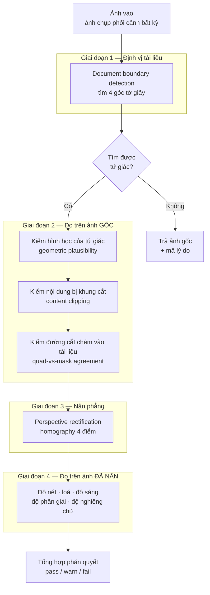
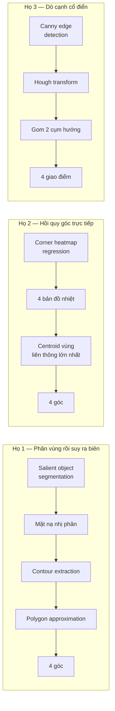
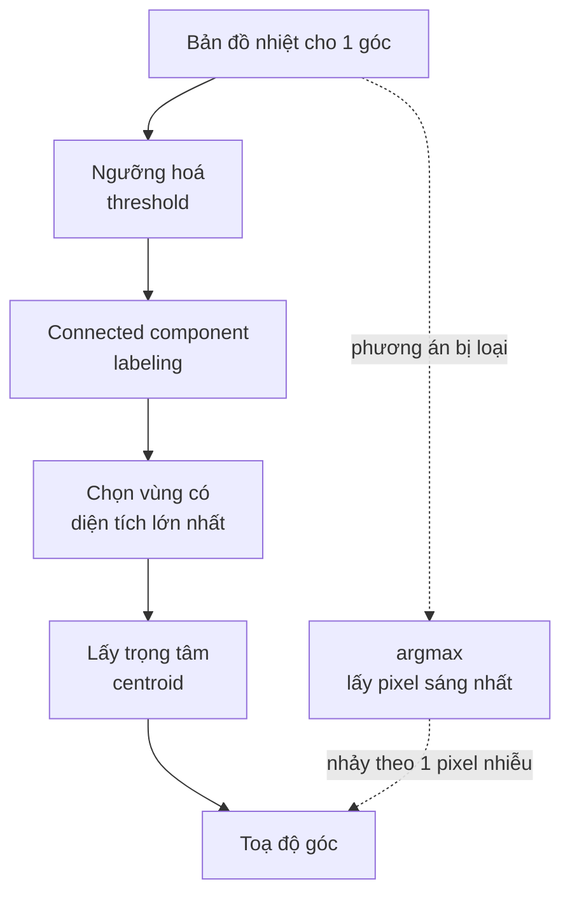
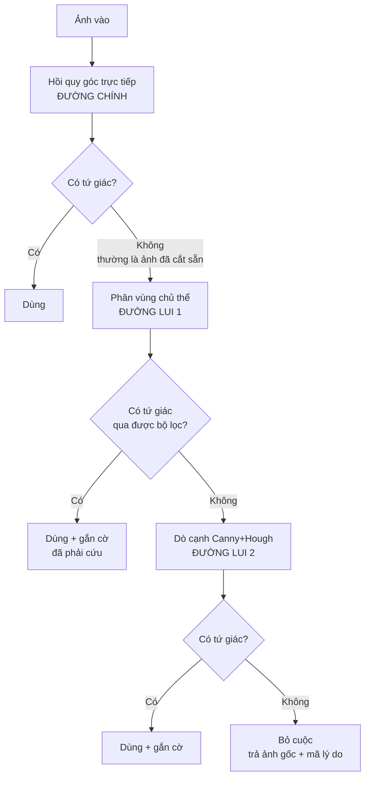
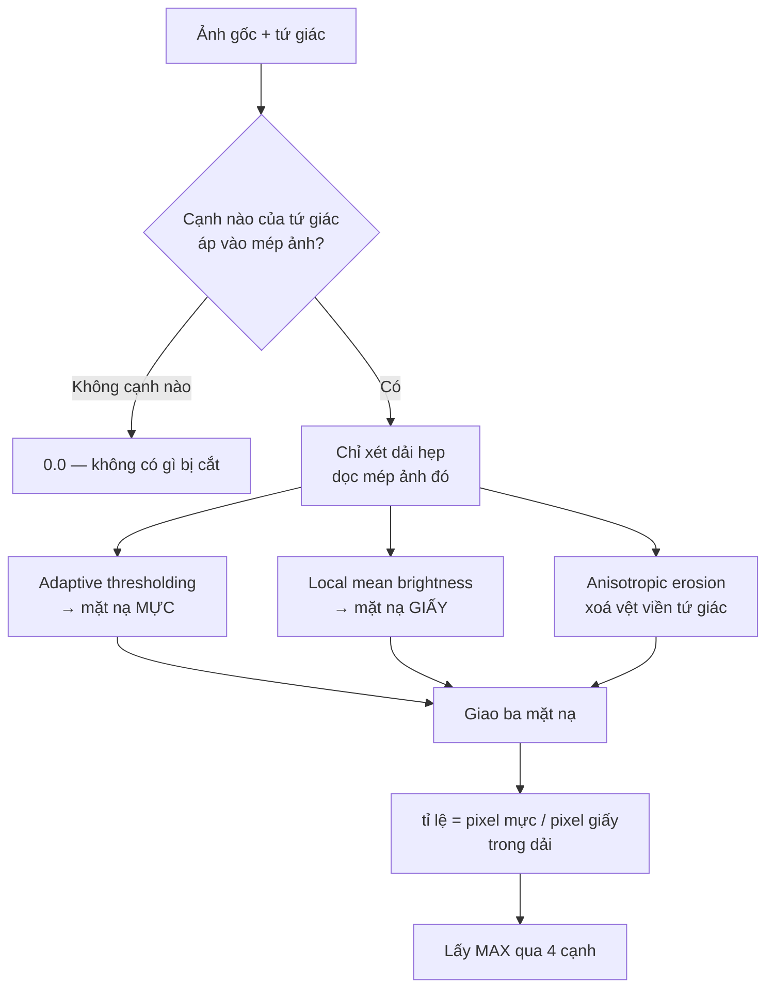
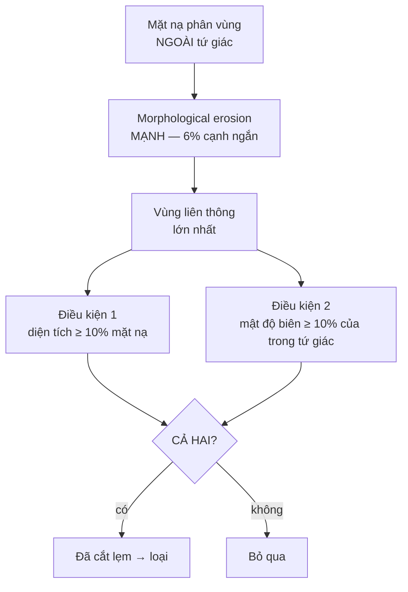
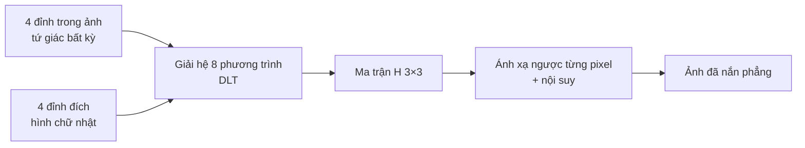
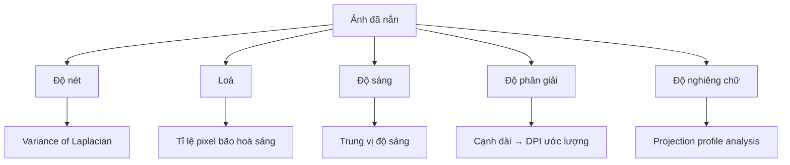
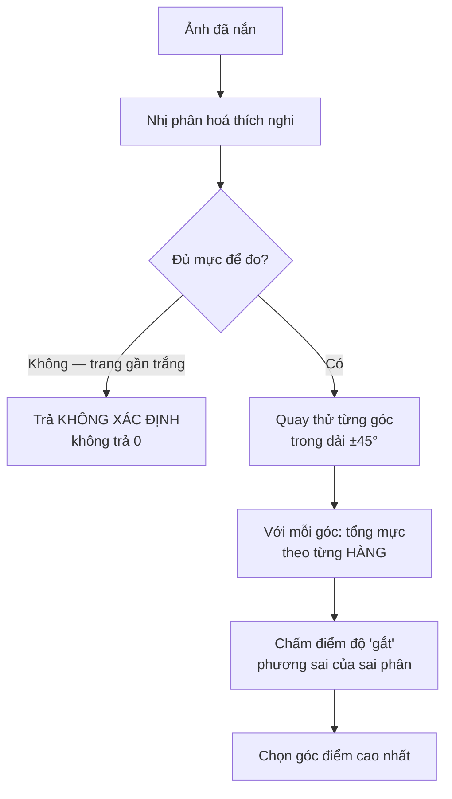
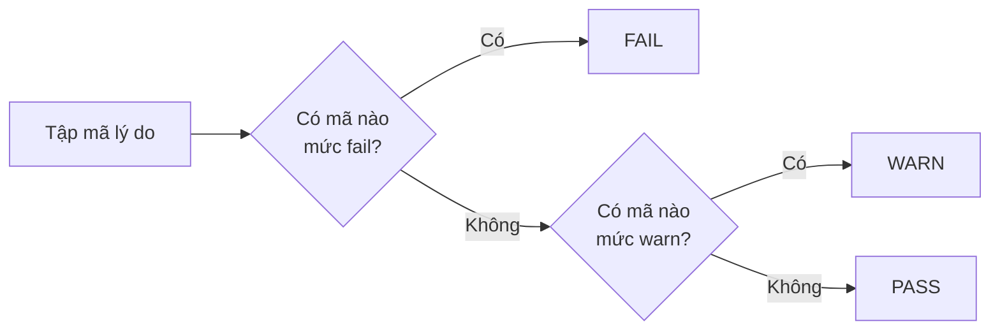

# Thuật toán trong QC Scanner — bản đọc để đối đáp kĩ thuật

Tài liệu này mô tả **thuật toán**, không mô tả phần mềm. Mỗi mục nói: bài toán là gì,
họ thuật toán nào giải nó, tên gọi chuẩn trong tài liệu quốc tế, và vì sao chọn nó
thay vì phương án cạnh tranh. Mục tiêu là để bạn ngồi với một đội kĩ thuật khác và
nói cùng một thứ tiếng.

Quy ước: thuật ngữ tiếng Anh để trong ngoặc, vì đó là dạng bên kia sẽ tra và sẽ dùng.

---

## 1. Bức tranh tổng thể

Bài toán tổng: cho một **ảnh chụp tài liệu bằng điện thoại**, quyết định xem nó có
đủ chất lượng để đưa vào OCR hay không, và trả về ảnh đã nắn phẳng.

Đây là bài **document image quality assessment (DIQA)** ghép với **document
boundary detection**. Hai bài này thường được nghiên cứu riêng; ở đây chúng nối tiếp
nhau, vì hầu hết phép đo chất lượng chỉ có nghĩa **sau khi** đã biết tờ giấy nằm ở đâu.

**Nguyên tắc xuyên suốt:** đo cái gì thì đo trên ảnh phù hợp với cái đó. Nội dung bị
khung hình cắt phải đo trên ảnh **gốc** — sau khi nắn, phần ngoài tứ giác bị điền
pixel đen, dải mép trở thành vùng đệm chứ không còn là nội dung. Ngược lại độ nét và
độ nghiêng chữ phải đo trên ảnh **đã nắn**, vì đó mới là thứ OCR nhìn thấy.

---

## 2. Giai đoạn 1 — Định vị tài liệu

Đây là phần có nhiều lựa chọn thuật toán nhất, và cũng là phần quyết định chất lượng
toàn hệ thống. Có ba họ, khác nhau **về bản chất**, không phải khác nhau về tham số.

### 2.1. Họ 1 — Phân vùng chủ thể (salient object segmentation)

**Ý tưởng:** hỏi mạng nơ-ron "pixel nào thuộc về vật thể chính trong ảnh", được một
**mặt nạ nhị phân** (binary mask), rồi suy ngược ra biên.

Kiến trúc dùng ở đây thuộc dòng **U²-Net / ISNet** — mạng mã hoá–giải mã (encoder–decoder)
kiểu U-Net nhưng lồng thêm một tầng U-Net bên trong mỗi khối, gọi là RSU block
(ReSidual U-block). Được huấn luyện cho **salient object detection**, tức "vật thể mà
mắt người sẽ nhìn vào trước tiên", chứ không phải cho tài liệu nói riêng. Đây vừa là
điểm mạnh vừa là điểm yếu, sẽ nói ở dưới.

Chuỗi hậu xử lý sau khi có mặt nạ, đây là chỗ dùng nhiều thuật ngữ:

1. **Contour extraction** — trích biên các vùng liên thông. Chỉ lấy biên ngoài cùng
   (`RETR_EXTERNAL`), vì lỗ thủng trong mặt nạ không phải ứng viên tài liệu.
2. **Polygon approximation** — thuật toán **Ramer–Douglas–Peucker**: đơn giản hoá một
   đường gấp khúc hàng nghìn điểm thành đa giác ít đỉnh, với sai số tối đa `ε`. Ở đây
   `ε` đặt theo **tỉ lệ chu vi** chứ không phải một số pixel cố định — nếu không thì
   thuật toán hành xử khác nhau giữa ảnh 1MP và ảnh 12MP.
3. Nếu ra đúng **4 đỉnh** → dùng luôn, độ tin cậy cao.
   Nếu không (5, 6, 7 đỉnh — thường do mép giấy cong hoặc bóng đổ) → lùi về
   **minimum-area rectangle** (hình chữ nhật xoay nhỏ nhất bao contour), và hạ độ tin cậy.
   Đây là điểm cần nói rõ với bên kĩ thuật: hình chữ nhật xoay **không mô tả được phối
   cảnh**, nó chỉ có 1 góc xoay chứ không có 4 đỉnh tự do, nên nó là phương án chữa cháy.

**Điểm mạnh:** hoạt động tốt khi tài liệu đã được cắt sẵn hoặc gần cắt sẵn, vì nó
không cần "thấy nền" để biết đâu là giấy.

**Điểm yếu quyết định:** khi nền lộn xộn (bàn làm việc có bút, sổ, cốc), "vật thể nổi
bật" không còn là tờ giấy. Đo trên bộ chuẩn quốc tế, ở nền loại này chỉ số trùng khớp
tụt xuống mức gần như không dùng được. Đây là **thất bại có hệ thống**, không phải
nhiễu ngẫu nhiên — vì bài toán mà mạng được huấn luyện vốn không phải bài toán của ta.

### 2.2. Họ 2 — Hồi quy góc trực tiếp (direct corner regression) ← đang dùng làm chính

**Ý tưởng khác hẳn:** không đi tìm vùng rồi suy ra góc. Hỏi thẳng mạng "4 góc tờ giấy
ở toạ độ nào". Đây là bài **keypoint localization**, cùng họ với ước lượng tư thế người
(human pose estimation) — và mượn luôn kĩ thuật của họ đó.

Mạng xuất ra **4 bản đồ nhiệt** (heatmap), mỗi bản một góc: trên-trái, trên-phải,
dưới-phải, dưới-trái. Mỗi bản đồ là một trường xác suất "góc này nằm ở đây".

Cách đọc toạ độ ra khỏi bản đồ nhiệt — chỗ này bên kĩ thuật hay hỏi:

Dùng **centroid của vùng liên thông lớn nhất**, không dùng **argmax**. Lý do: argmax
lấy đúng một pixel, nên một điểm nhiễu đơn lẻ đủ để kéo lệch cả góc. Centroid lấy
trung bình có trọng số cả vùng nên ổn định hơn nhiều. Trong tài liệu pose estimation,
biến thể mượt hơn nữa gọi là **soft-argmax** (trung bình có trọng số toàn bản đồ) —
cùng động cơ, khác chi tiết.

Lấy vùng **lớn nhất** thay vì mọi vùng vượt ngưỡng: khi trong ảnh có hai tờ giấy, bản
đồ nhiệt sẽ có hai cụm sáng, và trung bình cả hai sẽ cho một điểm nằm ở khoảng giữa —
tức một góc không thuộc tờ nào.

**Độ tin cậy** = giá trị đỉnh **thấp nhất** trong 4 bản đồ, không phải trung bình.
Đây là lựa chọn có chủ đích: một tứ giác chỉ chắc chắn bằng góc yếu nhất của nó. Lấy
trung bình sẽ để ba góc tốt che mất một góc hỏng — mà một góc hỏng là đủ để ảnh nắn ra
mất nội dung.

**Xương sống mạng (backbone):** dòng **FastViT** — kiến trúc lai tích chập với
transformer, thiết kế cho suy luận nhanh trên thiết bị. Có phiên bản nhẹ hơn nhiều dùng
**LCNet** làm xương sống và hồi quy thẳng ra 8 toạ độ (không qua bản đồ nhiệt), nhanh
hơn khoảng một bậc nhưng kém chính xác hơn.

**Điểm mạnh:** giữ được độ chính xác trên nền lộn xộn, vì nó học đặc trưng "góc tài
liệu" chứ không học "vật thể nổi bật".

**Điểm yếu đối xứng với họ 1:** khi ảnh đã được cắt sát, không còn nền quanh giấy, mô
hình không thấy "vật thể tài liệu" nào để định vị góc và trả về rỗng.

### 2.3. Họ 3 — Dò cạnh cổ điển (classical edge-based)

Không có học máy. Chuỗi kinh điển trong sách giáo khoa thị giác máy tính:

1. **Gaussian blur** — khử nhiễu tần số cao, nếu không Canny sẽ ra vô số cạnh giả.
2. **Canny edge detector** — dò cạnh với ngưỡng kép (hysteresis thresholding).
3. **Hough transform** dạng xác suất (probabilistic Hough) — gom pixel cạnh thành các
   **đoạn thẳng**.
4. Phân đoạn thẳng thành **hai cụm theo hướng** (ngang / dọc) bằng góc nghiêng.
5. Lấy đoạn ngoài cùng mỗi phía → **4 giao điểm** → tứ giác.

**Điểm mạnh:** không cần tách nền, nên nó có cơ hội ở đúng ca mà phân vùng thua nhất —
**giấy trắng trên nền sáng**.

**Điểm yếu:** không phân biệt được mép giấy với **đường kẻ trong tài liệu** (khung bảng,
viền form, đường gạch chân). Vì thế chỉ dùng làm đường lui cuối cùng.

### 2.4. Vì sao xếp tầng (cascade) chứ không chọn một

Ba họ trên thua ở **ba chỗ khác nhau**. Đó là điều kiện lý tưởng cho một **cascade**:

Hai điểm cần nhấn mạnh khi trình bày với bên khác:

- **Đường lui chỉ chạy khi đường trên KHÔNG tìm thấy gì**, không chạy khi đường trên
  tìm thấy một thứ trông đáng ngờ. Điều kiện kích hoạt kiểu "kết quả có vẻ không ổn"
  nghe hợp lý nhưng trong thực tế nó **thay một tứ giác đúng bằng một tứ giác sai** —
  và đó là kiểu hỏng đắt hơn hẳn so với việc không cứu được.
- Mỗi lần phải dùng đường lui đều được **gắn cờ ra kết quả**. Một hệ thống QC không
  được phép âm thầm hạ chất lượng.

### 2.5. Ngưỡng độ tin cậy không so sánh được giữa các họ

Đây là cái bẫy đáng nói nhất trong toàn bộ tài liệu này.

Ba họ thuật toán đều xuất ra một số gọi là "độ tin cậy", nhưng **ba số đó không cùng
đơn vị và không cùng phân phối**. Một bên là "polygon có ra đúng 4 đỉnh không" — thực
chất là biến nhị phân đội lốt số thực. Một bên là giá trị đỉnh bản đồ nhiệt — một số
thực có phân phối riêng, đo được là khá hẹp trên dữ liệu sạch và rộng hơn nhiều trên
ảnh thực tế.

Lấy ngưỡng hiệu chuẩn cho họ này áp cho họ kia là gắn cờ hàng loạt. Ngưỡng phải
**đi theo thuật toán đã sinh ra kết quả**, kể cả khi đó là đường lui.

### 2.6. Đo đạc — con số để đối đáp

| Tiêu chí | Phân vùng chủ thể | Hồi quy góc (heatmap) | Hồi quy góc (point) |
|---|---|---|---|
| Bản chất | segmentation + contour | keypoint regression | direct coordinate regression |
| Kích thước mô hình | ~176 MB | ~83 MB | ~5 MB |
| Thời gian suy luận (CPU) | ~330 ms | ~42 ms | ~6 ms |
| IoU trung bình trên bộ chuẩn | 0.96 | **0.99** | thấp hơn |
| Nền lộn xộn | sụp đổ | giữ vững | — |
| Ảnh đã cắt sẵn | tốt | trả rỗng | — |

**Chỉ số đánh giá:** dùng **IoU** (Intersection over Union) giữa tứ giác dự đoán và
tứ giác nhãn. Lưu ý khi so với số liệu công bố: bộ chuẩn SmartDoc 2015 công bố chỉ số
**Jaccard trong hệ toạ độ tài liệu** — tức chiếu cả hai tứ giác về mặt phẳng tờ giấy
rồi mới so. Hai chỉ số **không so sánh trực tiếp được với nhau**; nói "chúng tôi đạt
0.99" khi bên kia đo bằng thước khác là một so sánh sai.

---

## 3. Giai đoạn 2 — Kiểm tra trên ảnh gốc

### 3.1. Tính hợp lý hình học (geometric plausibility)

Rẻ, chạy trước, loại sớm những tứ giác không thể là tài liệu:

| Phép đo | Tên gọi | Bắt được gì |
|---|---|---|
| **Convexity test** | tích có hướng của các cạnh liên tiếp cùng dấu | tứ giác tự cắt, đỉnh xếp sai thứ tự |
| **Area ratio** | diện tích tứ giác / diện tích ảnh | bắt nhầm một ô bảng, một vệt nhiễu |
| **Skew ratio** | tỉ lệ dài/ngắn giữa hai cặp cạnh đối | phối cảnh cực đoan — chụp quá xiên |
| **Border contact** | số đỉnh nằm sát mép ảnh | tài liệu bị khung hình cắt |
| **Corners outside** | khoảng cách đỉnh lọt ra ngoài khung | tứ giác không nằm trong ảnh — chắc chắn sai |

`skew_ratio` là proxy cho **foreshortening**: chụp vuông góc thì hai cạnh đối bằng
nhau, tỉ lệ ≈ 1.0; chụp xiên thì cạnh xa ngắn lại. Đây không phải góc chụp thật (muốn
số đó phải phân rã ma trận homography), nhưng nó đơn điệu theo góc chụp và rẻ hơn nhiều.

Sắp đỉnh về thứ tự chuẩn **trên-trái → trên-phải → dưới-phải → dưới-trái** trước mọi
phép đo. Không có bước này thì mọi công thức đều sai lặng lẽ.

### 3.2. Phát hiện nội dung bị khung hình cắt — phần tinh vi nhất

**Bài toán:** phân biệt hai thứ mà hình học không phân biệt được:

- Tứ giác chạm mép ảnh nhưng chỉ **mất viền trắng** → chấp nhận được.
- Tứ giác chạm mép ảnh và **mất chữ** → hỏng, phải loại.

Chỉ đếm "có mấy đỉnh chạm mép" thì vừa báo thừa vừa báo thiếu. Cần đo thẳng vào
**nội dung**.

Ba ý tưởng thuật toán chồng lên nhau ở đây, mỗi cái giải một vấn đề cụ thể:

**(a) Ngưỡng thích nghi cục bộ (adaptive thresholding), không phải ngưỡng toàn cục.**
Cái cần đếm là "tối **hơn giấy quanh nó**", không phải "tối". Ngưỡng toàn cục kiểu
**Otsu** giả định ảnh có phân phối độ sáng hai đỉnh (bimodal) — đúng với trang scan
phẳng, sai với ảnh chụp có bóng đổ chuyển dần. Ngưỡng thích nghi lấy trung bình
Gaussian trong một cửa sổ cục bộ làm mốc, nên bóng đổ trôi từ từ không bị đọc thành mực.

Kích thước cửa sổ đặt theo **tỉ lệ cạnh ngắn của ảnh**, không phải hằng số pixel — cùng
lý do với `ε` của Douglas–Peucker.

**(b) Cổng "giấy" (paper gating) — chỗ mà công thức ngây thơ hỏng.**

Ngưỡng thích nghi trả lời "tối hơn xung quanh". Câu đó đúng cho chữ trên giấy, nhưng
**cũng đúng cho vân gỗ trên mặt bàn**. Khi thuật toán định vị khoanh nhầm cả mặt bàn
vào trong tứ giác, hai thứ đó không còn phân biệt được, và ảnh hoàn toàn tốt bị báo là
mất nội dung.

Cách tách: mực là nét tối **trên nền sáng**. Lấy **độ sáng trung bình cục bộ** làm
thước — nền cục bộ sáng ≈ giấy, nền cục bộ tối ≈ mặt bàn hoặc bóng đổ.

Mốc "sáng" phải suy từ **chính ảnh đó**, không phải hằng số tuyệt đối, vì ảnh thiếu
sáng thì cả tờ giấy cũng tối đi. Kĩ thuật: lấy một **phân vị cao** (high percentile)
của độ sáng cục bộ bên trong tứ giác làm mốc "giấy".

Chọn phân vị nào là một quyết định có hậu quả thật. Phân vị trung bình (p75) **hỏng**:
khi tứ giác trùm phần lớn mặt bàn, phân vị đó rơi thẳng vào vùng nền, mốc tụt xuống, và
**toàn bộ mặt bàn được nhận là giấy**. Đáng sợ ở chỗ nó hỏng **im lặng** — mọi phép
kiểm cắt xén tắt hết mà không có tín hiệu nào bật lên. Phải đẩy lên phân vị cao (p90)
để có khoảng đệm.

Điểm này đáng nhấn mạnh khi thảo luận: **loại nền khỏi cả tử số lẫn mẫu số**. Giữ nền
trong mẫu số cũng sai, chỉ sai theo hướng ngược lại — nó pha loãng tỉ lệ và giấu mất
chữ thật bị cắt trong một dải phần lớn là mặt bàn.

**(c) Xói mòn dị hướng (anisotropic erosion).**

Đường biên tứ giác luôn có vệt tối — mép giấy, bóng đổ, ranh giới giấy/nền — mà ngưỡng
thích nghi đọc thành mực. Phải **co mặt nạ** (morphological erosion) trước khi đếm.

Nhưng co **đều** thì hỏng: nó ăn luôn vào phía mép ảnh, đúng chỗ cần soi. Giải pháp là
dùng **nhân dẹt** (kernel 1×n hoặc n×1) song song với mép ảnh đang xét — xoá được ranh
giới cắt ngang dải mà không đụng tới chiều vuông góc với khung hình.

**(d) Gộp bằng MAX, không bằng trung bình.** Mất một dòng ở **một** cạnh đã đủ hỏng bản
ghi. Trung bình sẽ pha loãng nó với ba cạnh sạch.

### 3.3. Phát hiện đường cắt của chính ta chém vào tài liệu

Mục 3.2 giải bài *"khung hình có cắt mất chữ không"*. Còn một bài khác hẳn mà nó
**không chạm tới**: tứ giác nằm gọn giữa khung rồi **tự nó** chém chéo qua tờ giấy.

Đây là điểm mù có cấu trúc, đáng nêu vì nó là bài học thiết kế chung: mọi phép kiểm ở
mục 3.2 chỉ soi những cạnh mà tứ giác **áp vào mép ảnh**. Khi tứ giác không chạm mép
nào, chúng trả về 0 — và con số 0 đó **không có nghĩa "không mất gì"**, nó có nghĩa
"phép kiểm không hề chạy". Hai điều đó trông giống hệt nhau ở đầu ra.

**Ý tưởng giải:** so tứ giác với **mặt nạ phân vùng** đã có từ giai đoạn 1. Nếu một
mảng lớn của mặt nạ nằm ngoài tứ giác, đường cắt đã bỏ rơi một phần tài liệu.

Ba quyết định trong đó, mỗi cái sinh ra từ một lần đo thất bại:

**(a) Vì sao phải co mạnh.** Mặt nạ luôn rộng hơn tứ giác một **viền mỏng bao quanh**,
và vì nó bao quanh nên diện tích cộng lại rất đáng kể — ảnh cắt hoàn toàn đúng vẫn cho
0.074. Vết cắt thật thì **dồn về một phía** và đặc. Phép co phân biệt đúng hai hình
dạng đó: ở mức 6% cạnh ngắn, viền tan hết (0.074 → 0.000) còn vết cắt gần như nguyên
(0.250 → 0.195). Đây **không phải** bước khử nhiễu mà là điều kiện phân biệt chính.

**(b) Vì sao diện tích một mình không đủ.** Tỉ lệ mảng bỏ rơi lẫn **hai chuyện ngược
nhau**: *tứ giác quá nhỏ* (cắt lẹm thật) và *mặt nạ quá lớn* (phân vùng trùm cả mặt
bàn). Trong dữ liệu thực đo, một ảnh cắt **hoàn toàn đúng** nhưng mặt nạ trùm mặt bàn
cho tỉ lệ **cao hơn cả ba ca cắt lẹm thật** — tức nếu chỉ đo diện tích thì báo động
giả đứng đầu bảng. Cần một điều kiện thứ hai, độc lập.

**(c) Vì sao đo mật độ biên chứ không đo mực.** Điều kiện thứ hai hỏi "mảng đó có
**cấu trúc như tài liệu** không" — mặt bàn thì trơn, nửa tài liệu bị cắt thì đầy chữ,
dấu, hoa văn. Cách tự nhiên là dùng lại mặt nạ mực ở mục 3.2, và **nó hỏng**: mặt nạ
mực tìm nét **tối trên nền sáng**, còn ca thật đầu tiên gặp phải là **bìa sổ đỏ nền
đỏ sẫm, chữ nhũ vàng** — sáng trên tối. Cả mặt nạ mực lẫn cổng giấy (đều dựa trên độ
sáng) đều trả 0 ở đó, tức thước đo **im lặng bỏ sót đúng ca cần bắt**.

Mật độ biên (Canny) không giả định chiều tương phản nên không có điểm mù ấy. Đây là
một nguyên tắc đáng mang sang chỗ khác: **thước đo giả định càng ít về dữ liệu thì
càng khó bị một loại tài liệu mới làm cho câm lặng.**

Một phương án nữa đã thử và loại: hỏi "cạnh tứ giác có **tựa vào biên thật** trong ảnh
không" — tứ giác đúng thì cạnh nằm trên mép giấy, đường cắt lẹm thì chạy giữa lòng tài
liệu nơi không có biên vật lý nào đỡ. Nghe rất thuyết phục, nhưng đo ra **ngược hoàn
toàn**: nó chấm ảnh cắt đúng 0.000 và các ca cắt lẹm thật 0.405–0.515.

### 3.4. Phát hiện nhiều tài liệu trong khung

Đếm số **vùng liên thông** (connected component) đủ lớn trong mặt nạ phân vùng, không
đếm số ứng viên mà thuật toán định vị chính trả về.

Lý do là một bài học kiến trúc đáng kể: mô hình hồi quy góc **chỉ trả về đúng một tứ
giác**. Nếu phép kiểm này đếm ứng viên của thuật toán chính, thì ngày đổi thuật toán
chính, phép kiểm tự **tắt hoàn toàn** mà không có gì báo. Phép kiểm QC không được phụ
thuộc vào lựa chọn thuật toán của giai đoạn khác.

---

## 4. Giai đoạn 3 — Nắn phẳng phối cảnh

Bài toán chuẩn: **perspective rectification** qua **homography** — phép biến đổi xạ ảnh
(projective transform) 8 bậc tự do, ánh xạ một mặt phẳng sang một mặt phẳng.

- 4 cặp điểm cho 8 phương trình, vừa đủ xác định 8 bậc tự do (ma trận 3×3 nhưng chỉ xác
  định sai khác một hệ số tỉ lệ). Đây là **direct linear transform (DLT)**.
- Kích thước đích suy từ chiều dài các cạnh tứ giác.
- **Nội suy (interpolation):** dùng **bicubic** chứ không dùng bilinear. Ảnh này đi
  tiếp vào OCR, và **nét chữ nhỏ là thứ mất trước tiên** khi nội suy. Đây là đánh đổi
  có ý thức: bicubic đắt hơn nhưng giữ tần số cao tốt hơn.

**Hạn chế cần nói thẳng:** homography giả định tài liệu là một **mặt phẳng**. Giấy cong
— sách mở, tờ giấy vênh — vi phạm giả định này và homography không sửa được. Bài đó
tên là **document dewarping**, cần mô hình mặt cong (lưới biến dạng, hoặc mô hình trụ)
và là một lớp bài toán khác hẳn về độ phức tạp. Đã đo độ cong trên dữ liệu thực tế và
**chốt không làm** — chi phí không tương xứng với mức cải thiện.

### 4.1. Xử lý mép giấy cong ở mức tứ giác

Có một vấn đề nhỏ nhưng thật: khi mép giấy cong nhẹ, **dây cung** nối hai đỉnh nằm
*bên trong* tờ giấy, nên cắt theo tứ giác sẽ **lẹm vào nội dung**.

Cách xử lý rẻ tiền: đẩy từng cạnh ra ngoài cho tới khi tứ giác **bao trọn** contour, có
giới hạn nới tối đa để không nuốt cả nền. Dùng **phân vị** của khoảng cách từ điểm
contour tới cạnh, không dùng cực đại — cực đại chạy theo một điểm nhiễu duy nhất.

Lưu ý về thứ tự: **phán quyết hình học phải đo trên tứ giác GỐC, không đo trên tứ giác
đã nới**. Nới rồi mới đo thì đỉnh chạm mép ảnh do chính phép nới gây ra, và ảnh tốt bị
báo lỗi. Nới chỉ để **cắt**, không để **chấm điểm**.

---

## 5. Giai đoạn 4 — Đo chất lượng trên ảnh đã nắn

Đây là phần **document image quality assessment** đúng nghĩa.

### 5.1. Độ nét — Variance of Laplacian

**Toán tử Laplace** là đạo hàm bậc hai không gian; nó phản hồi mạnh ở chỗ độ sáng thay
đổi đột ngột, tức là ở **cạnh**. Ảnh nét có nhiều cạnh sắc → phản hồi phân tán rộng →
**phương sai lớn**. Ảnh mờ thì cạnh bị làm nhoè → phản hồi co cụm → phương sai nhỏ.

Các phương án cùng họ, nên biết tên để đối đáp:
- **Tenengrad** — dựa trên độ lớn gradient Sobel.
- **Brenner gradient** — hiệu bình phương giữa các pixel cách nhau 2 ô.
- **Các chỉ số miền tần số** — năng lượng tần số cao qua FFT hoặc wavelet.

Điểm yếu **cần nói thẳng** khi bị hỏi: variance of Laplacian là chỉ số **không có thang
tuyệt đối**. Nó phụ thuộc vào lượng nội dung trong ảnh — một trang thưa chữ cho điểm
thấp hơn một trang dày chữ dù cùng độ nét. Vì thế ngưỡng phải hiệu chuẩn theo loại tài
liệu, và đây là hạn chế đã biết, chưa giải quyết.

### 5.2. Loá — specular highlight

Tỉ lệ pixel có độ sáng gần bão hoà. Bắt hiện tượng **phản xạ gương** (specular
reflection) — đèn trần hoặc flash dội thẳng vào giấy bóng, làm mất hẳn thông tin ở
vùng đó.

Hạn chế đã biết: đây là **cờ phẳng** — một tỉ lệ so với một ngưỡng. Nó không biết vùng
loá **nằm ở đâu**. Loá 5% vào đúng số CCCD nghiêm trọng hơn hẳn loá 15% ở lề trắng.
Muốn làm đúng thì phải đo **loá có trọng số theo vùng có chữ**.

### 5.3. Độ sáng — trung vị, không phải trung bình

Dùng **trung vị** (median) chứ không dùng trung bình (mean): trung vị là **thống kê
bền vững** (robust statistic), không bị một vùng loá trắng hoặc một mảng nền đen kéo
lệch. Cùng hạn chế "cờ phẳng" như trên.

### 5.4. Độ phân giải — DPI ước lượng

Từ số pixel cạnh dài, giả định khổ giấy A4, suy ra **DPI hiệu dụng**. Mốc tham chiếu
thường được viện dẫn trong ngành số hoá tài liệu là **300 DPI** cho OCR văn bản in.

Hạn chế: giả định A4 sai với CCCD, hộ chiếu, hoá đơn nhiệt. Cách đo đúng hơn về mặt lý
thuyết là ước lượng **chiều cao chữ tính bằng pixel** (x-height), vì đó mới là thứ
quyết định OCR đọc được hay không — độc lập hoàn toàn với khổ giấy.

### 5.5. Độ nghiêng chữ — projection profile analysis

Đây là phép đo **quan trọng nhất** trong nhóm này, vì nó là phép kiểm **đầu ra**, không
phải phỏng đoán **đầu vào**.

Mọi phép đo hình học ở giai đoạn 2 đều soi tứ giác *trước khi* nắn và hỏi "biên này có
hợp lý không". Phép đo này soi kết quả *sau khi* nắn và hỏi thẳng **"chữ có nằm ngang
không"** — thứ duy nhất phía OCR thật sự cần. Nhờ vậy nó bắt được cả những kiểu hỏng
chưa ai kể tên, miễn là chúng làm lệch chữ.

**Nguyên lý:** chữ nằm ngang thì khi chiếu tổng lượng mực theo từng hàng, ta được một
tín hiệu **luân phiên đậm–nhạt rất mạnh** — đậm ở dòng chữ, nhạt ở khoảng giữa dòng.
Chữ nghiêng thì các dòng nhoè vào nhau và tín hiệu **bẹt đi**. Vậy góc đúng là góc làm
tín hiệu gắt nhất; đo độ gắt bằng **phương sai của sai phân bậc một** của profile.

**Vì sao không dùng phương án phổ biến hơn** — gộp ký tự thành dòng bằng phép hình thái
rồi đo `minAreaRect`: phương án đó cần một **nhân hình thái nằm ngang**, tức là nó
**giả định sẵn chính cái đang cần kiểm**. Đo thực tế trên một ảnh nắn hỏng: phương án
gộp-dòng báo `0.0°` trong khi chữ lệch 24°, vì chữ chéo không gộp nổi thành dòng nên
rơi khỏi phép đo. Projection profile thử mọi góc như nhau nên không có điểm mù đó.

**Cổng lượng mực tối thiểu là bắt buộc, không phải đề phòng.** Trang trắng cho mọi góc
cùng điểm 0, nên `argmax` trả về ứng viên đầu tiên trong dải quét — tức góc âm cực đại.
Không có cổng thì **trang trắng bị kết luận nghiêng 45°**.

Và khi không đủ mực, phải trả **"không xác định"**, tuyệt đối không trả 0. Trả 0 là
khẳng định một điều mình chưa hề đo.

**Sai số của chính thước đo:** kiểm bằng cách quay một ảnh đã nắn đi những góc biết
trước rồi bắt nó đọc lại — sai số ≤ 1.0°. Đây là loại kiểm chứng đáng có cho mọi phép
đo, và là câu trả lời tốt khi bên kĩ thuật hỏi "làm sao biết thước đúng".

### 5.6. Nắn thẳng phần dư (deskew)

Sau khi **đã chấm điểm xong**, xoay ảnh đi góc vừa đo. Ba chi tiết:

- **Thứ tự bắt buộc:** đo trước, xoay sau. Ngược lại thì báo cáo QC nói ảnh nào cũng
  thẳng, vì số ghi lại là góc còn dư sau khi đã sửa.
- **Không bao giờ xoay khi góc vượt ngưỡng cho phép.** Lệch 24° không phải "hơi nghiêng"
  mà là **phép nắn đã hỏng**. Xoay nó về 0 chỉ **giấu cái hỏng đi** — ảnh vẫn mất nội
  dung, nhưng nay trông hợp lệ. Đây là nguyên tắc QC, không phải chi tiết kĩ thuật.
- **Điền biên bằng nhân bản mép** (border replicate), không tô trắng: nền quanh tài
  liệu có thể là mặt bàn tối, tô trắng vào đó là **bịa ra giấy** ở chỗ vốn không có
  giấy — và các phép đo độ sáng, mực-ở-mép đều đọc vùng đó.

---

## 6. Tổng hợp phán quyết

Không có mô hình chấm điểm nào ở đây. Mỗi phép kiểm phát ra **mã lý do** rời rạc, mỗi
mã có mức nghiêm trọng gắn cứng. Phán quyết cuối là **mức nặng nhất** trong các mã đã phát.

**Bất biến của hệ thống:** `pass` ⟺ **tập mã rỗng**. Không có "pass kèm ghi chú".

Vì sao chọn cách này thay vì một điểm số tổng hợp:

- **Giải thích được.** Mỗi phán quyết trỏ tới một phép đo cụ thể với một con số cụ thể.
  Điểm số tổng hợp trả lời "0.62" và không ai biết làm gì với nó.
- **Không đánh đổi ngầm.** Trong một điểm số có trọng số, độ nét rất tốt có thể **bù**
  cho việc mất một dòng chữ. Với OCR thì đó không phải bù trừ được — mất dòng là mất
  dòng.
- **Chỉnh được từng phần.** Hiệu chuẩn lại một ngưỡng không làm dịch chuyển mọi thứ khác.

Một nguyên tắc vận hành đi kèm: khi hai mã cùng mô tả **một** hiện tượng, mã nặng hơn
**thay thế** mã nhẹ hơn chứ không cộng thêm. Giữ cả hai chỉ làm loãng lý do thật và làm
người đọc kết quả mất phương hướng.

---

## 7. Bảng thuật ngữ Việt–Anh

| Tiếng Việt trong tài liệu này | Thuật ngữ chuẩn |
|---|---|
| Định vị biên tài liệu | document boundary / edge detection |
| Phân vùng chủ thể nổi bật | salient object detection / segmentation |
| Mặt nạ nhị phân | binary mask |
| Trích biên vùng | contour extraction |
| Đơn giản hoá đa giác | polygon approximation, Ramer–Douglas–Peucker |
| Hình chữ nhật xoay nhỏ nhất | minimum-area rectangle |
| Bao lồi | convex hull |
| Hồi quy điểm mốc | keypoint / landmark regression |
| Bản đồ nhiệt | heatmap |
| Vùng liên thông | connected component |
| Trọng tâm | centroid |
| Lấy cực đại mềm | soft-argmax |
| Xương sống mạng | backbone |
| Dò cạnh Canny | Canny edge detection |
| Biến đổi Hough | Hough transform |
| Xếp tầng đường lui | cascade / fallback chain |
| Nắn phẳng phối cảnh | perspective rectification |
| Ma trận đồng dạng xạ ảnh | homography |
| Phép biến đổi tuyến tính trực tiếp | direct linear transform, DLT |
| Nội suy song khối | bicubic interpolation |
| Nắn giấy cong | document dewarping |
| Ngưỡng hoá thích nghi | adaptive thresholding |
| Ngưỡng hoá toàn cục theo phân phối | Otsu's method |
| Phép co hình thái | morphological erosion |
| Nhân dị hướng | anisotropic kernel |
| Chiếu profile theo hàng | projection profile analysis |
| Nắn nghiêng | deskewing |
| Phương sai Laplace | variance of Laplacian |
| Phản xạ gương / loá | specular highlight |
| Thống kê bền vững | robust statistic |
| Đánh giá chất lượng ảnh tài liệu | document image quality assessment, DIQA |
| Tỉ lệ giao trên hợp | Intersection over Union, IoU |

---

## 8. Những câu bên kĩ thuật hay hỏi, và câu trả lời

**"Sao không dùng một mô hình end-to-end cho cả QC?"**
Vì QC cần **giải thích được**. Một mô hình duy nhất trả về "0.62" không nói được ảnh
hỏng ở đâu, mà đó chính là thứ người chụp lại cần biết. Ngoài ra không có bộ dữ liệu
gán nhãn "đạt/không đạt" đủ lớn cho loại tài liệu này.

**"Ngưỡng lấy ở đâu ra?"**
Đo trên dữ liệu thực tế và trên một bộ chuẩn công khai có nhãn. Nói thẳng phần chưa
làm: các ngưỡng chất lượng **chưa được hiệu chuẩn ngược từ tỉ lệ lỗi OCR** — tức chưa
chứng minh được "dưới ngưỡng này thì OCR sai nhiều hơn". Đó là bước hiệu chuẩn còn nợ.

**"Sao chỉ số IoU của các anh cao hơn bài báo?"**
Không cao hơn — **đo bằng thước khác**. Xem mục 2.6.

**"Vì sao không nắn giấy cong?"**
Đã đo độ cong trên dữ liệu thực tế và kết luận chi phí không tương xứng. Đây là quyết
định có số liệu, không phải bỏ qua.

**"Chạy được real-time không?"**
Bước định vị ~40ms trên CPU. Nhưng tổng thời gian bị chi phối bởi việc **vẫn phải chạy
cả mô hình phân vùng** cho đường lui và cho phép kiểm nhiều-tài-liệu. Đây là chi phí
của tính bền vững, và là chỗ tối ưu rõ ràng nhất nếu cần nhanh hơn.

---

## 9. Hạn chế đã biết — nên chủ động nêu

Nêu trước thì đó là sự cẩn trọng; để bên kia tìm ra thì đó là thiếu sót.

1. **Chưa hiệu chuẩn theo OCR.** Ngưỡng chất lượng dựa trên phán đoán thị giác, chưa
   dựa trên tỉ lệ lỗi ký tự thực đo.
2. **Loá và thiếu sáng là cờ phẳng.** Không xét vị trí vùng hỏng so với vùng có chữ.
3. **Độ nét không có thang tuyệt đối.** Phụ thuộc mật độ nội dung của trang.
4. **DPI giả định khổ A4.** Sai với thẻ, hộ chiếu, hoá đơn nhiệt.
5. **Phép kiểm đường-cắt-chém-vào-tài-liệu (mục 3.3) dựa vào mặt nạ phân vùng**, nên
   nó thừa hưởng luôn điểm yếu của mặt nạ. Trên nền bàn bừa bộn — đúng chỗ phân vùng
   sụp đổ — mảng bỏ rơi lớn có thể là vì *mặt nạ* sai chứ không phải vì tứ giác sai.
   Điều kiện mật độ biên chặn được nền **trơn**, nhưng nền **bừa bộn** thì có cấu
   trúc. Đã đo 32/32 đúng trên dữ liệu thực tế, nhưng **chưa đo trên bộ chuẩn**.
6. **Không có mô hình mặt cong.** Giấy vênh nhiều thì kết quả nắn sai và không có phép
   kiểm nào bắt được trực tiếp — chỉ bắt gián tiếp qua độ nghiêng chữ.
